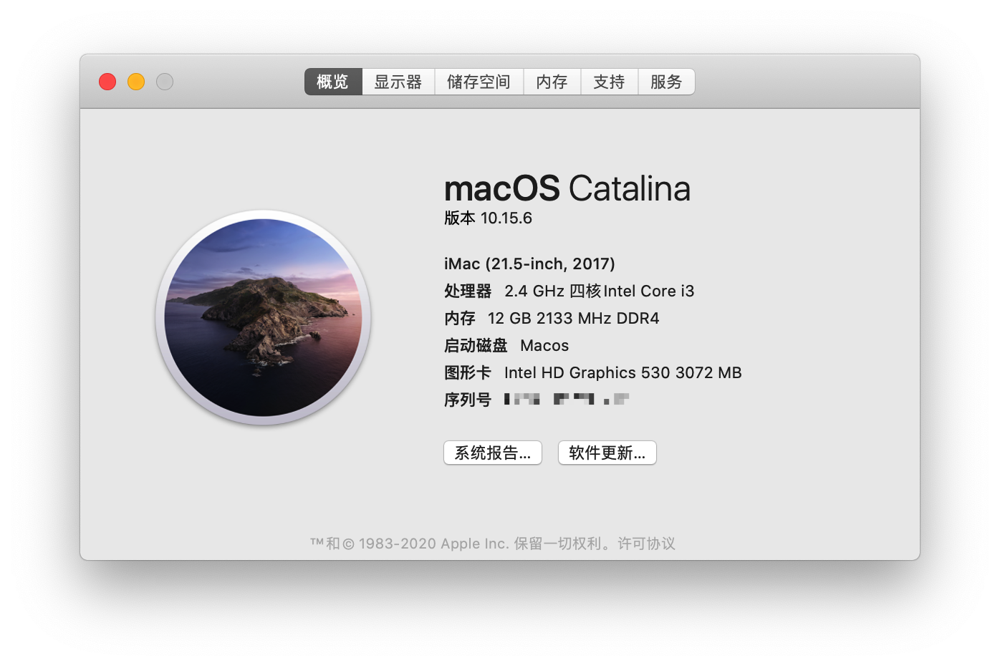
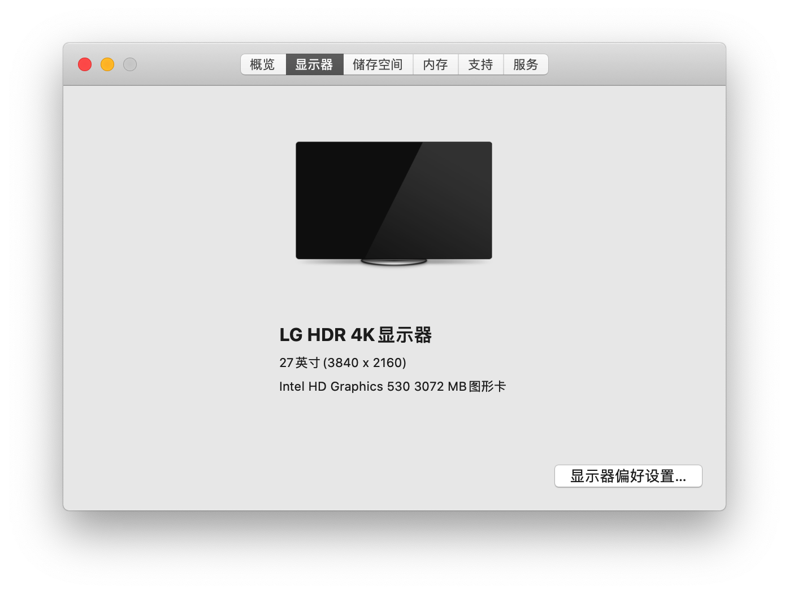
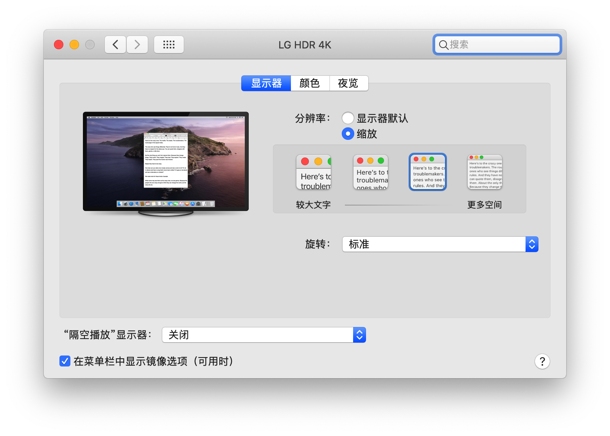
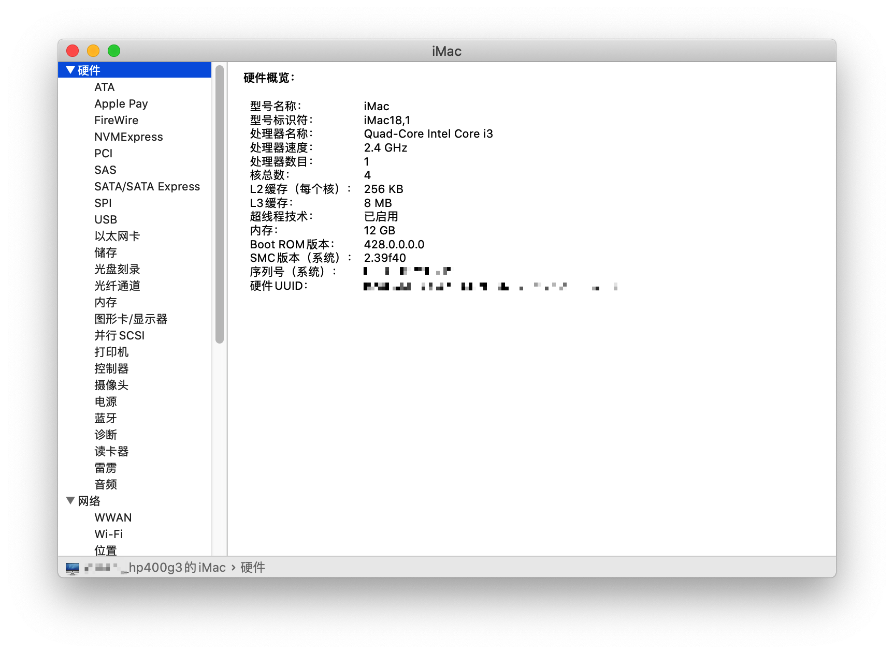
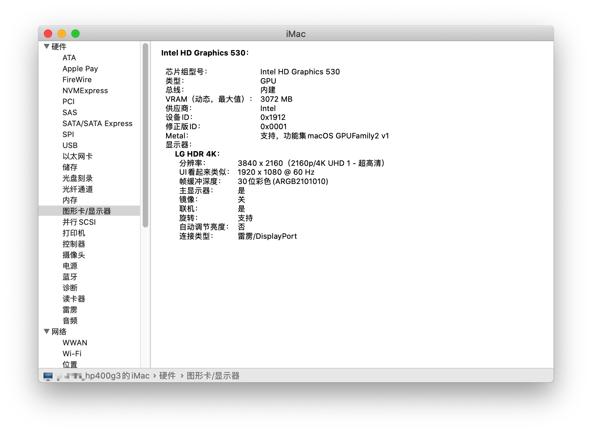
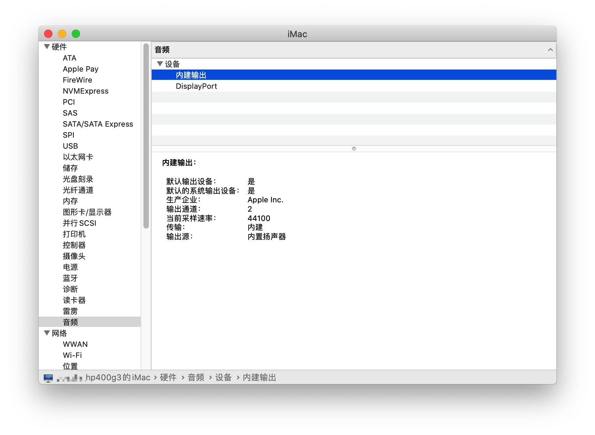
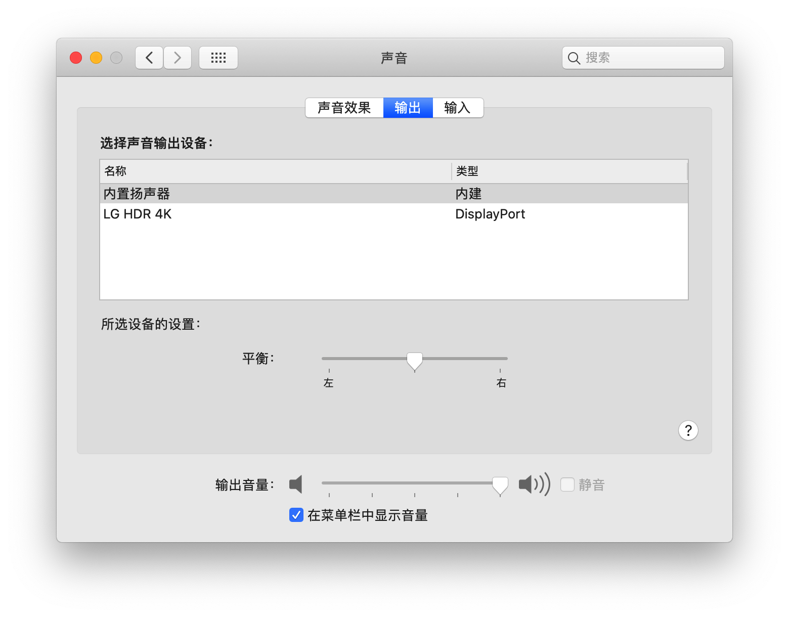
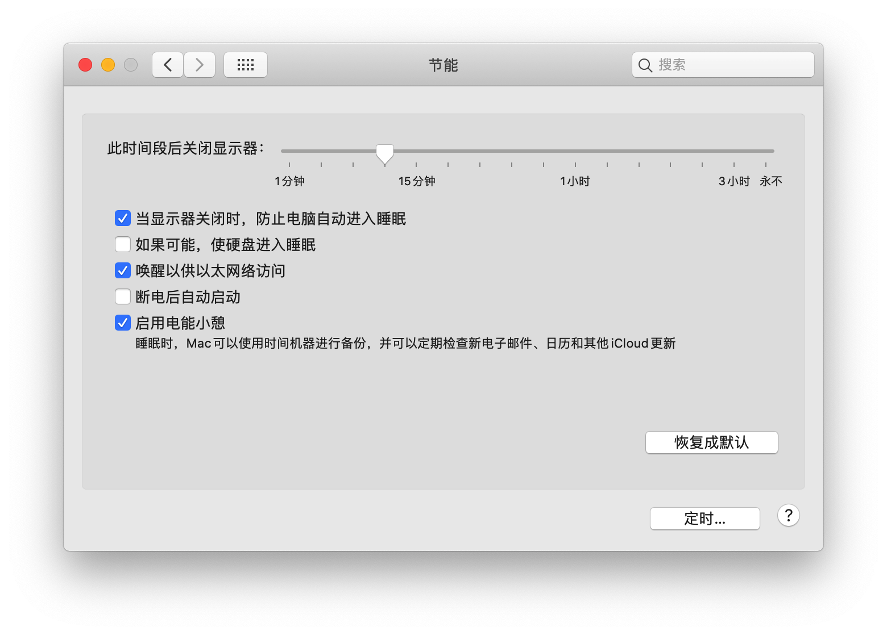

# OpenCore_for_HP400G3DM-ql3x
OpenCore_for_HP400G3DM-ql3x

```
Model              HP400G3DM
Mainboard          Intel H270
CPU                QL3X(Intel Core i7-7820HK ES)
Memory             8G DDR4 2666MHz
Graphics           Intel HD Graphics 630
Audio              Conexant Cx20632
Ethernet           Realtek RTL8168H/8111H
Monitor            4k 3840 x 2160
macOS Version      Catalina 10.15.6
OpenCore Version   0.6.1
```






